# Hands On Lab instructions for the Cloud Native Development

Table of Contents
=================

   * [Hands On Lab instructions for the Cloud Native Development](#hands-on-lab-instructions-for-the-cloud-native-development)
   * [Table of Contents](#table-of-contents)
      * [Requirements](#requirements)
      * [Lab Scenario](#lab-scenario)
      * [Objectives](#objectives)
         * [Discover the OpenShift platform](#discover-the-openshift-platform)
         * [Generate Spring Boot Cloud Native Front project using the launcher](#generate-spring-boot-cloud-native-front-project-using-the-launcher)
         * [Create a MySQL service instance using the Service Catalog](#create-a-mysql-service-instance-using-the-service-catalog)
         * [Use the launcher to generate a Cloud Native Demo - Backend zip](#use-the-launcher-to-generate-a-cloud-native-demo---backend-zip)
         * [Debug your application](#debug-your-application)
         * [Develop an Arquillian Cube Test](#develop-an-arquillian-cube-test)
         * [Use Distributed Tracing to collect app traces](#use-distributed-tracing-to-collect-app-traces)
         * [Show case horizontal scaling](#show-case-horizontal-scaling)
         * [S2I Build using pipeline](#s2i-build-using-pipeline)
   * [How to share your feedback](#how-to-share-your-feedback)
   * [Lab material for instructors](#lab-material-for-instructors)


## Requirements

1. Java - 1.8.x

2. Maven - 3.5.x

3. OpenShift oc client - [3.7.0](https://docs.openshift.org/latest/cli_reference/get_started_cli.html#installing-the-cli)

## Lab Scenario

The purpose of this lab is to develop and deploy 2 microservices on the OpenShift platform; a front and backend and to use a MySQL Database which has been provisioned as a service.
The `objectives` section defined hereafter summarizes the features that you will play with this Hands On Lab material.

## Objectives

- Discover OpenShift Cloud Platform
- Play with the different strategies to build a project on the platform
- Develop a real application (front, backend, database)
- Use Service Catalog to instantiate a service
- Debug a microservice
- Design a JUnit Integration test using Arquillian Cube
- Enable Distributed Tracing
- Use Jenkins CI/CD and Pipeline

### Discover the OpenShift platform

Time: 15min

- The machines to be accessed are defined according to your user

  - User from 1 to 30   : `https://195.201.87.126:8443/console/`
  - Users from 31 to 50 : `https://46.4.81.220:8443/console/`

- Convention to follow to log on the OpenShift cluster
  
  - user : user1, user2, ....., user30
  - password : pwd1, pwd2, ......, pwd50

- Open the OpenShift Cluster within your browser and verify that you can log on to the machine using your user/pwd

Remark: Use the user/pwd and IP address assigned to you

- Get the token from the `command-line` screen using this URL `https://HETZNER_IP_ADDRESS:8443/console/command-line`
- Next, execute this command within your terminal to access to the cluster using your `oc` client tool (making sure you substitute the token with one from the previous step)

```bash
oc login https://HETZNER_IP_ADDRESS:8443 --token=3WiSqc3JyW5dkJ5izQvOBVFK-njXTTnpse8ruLiYaoQ
Logged into "https://HETZNER_IP_ADDRESS:8443" as "user1" using the token provided.

You have one project on this server: "project1"

Using project "project1".
```

- Check the status of the project

```bash
oc status
In project project1 on server https://HETZNER_IP_ADDRESS:8443

You have no services, deployment configs, or build configs.
Run 'oc new-app' to create an application.
```

- Familiarize your self with the `oc` client and look to the different commands

```bash
oc -h
```

### Generate Spring Boot Cloud Native Front project using the launcher

Time: 30 min

- Access to the launcher using the following URL `http://launchpad-nginx-my-launcher.HETZNER_IP_ADDRESS.nip.io`
- From the `launcher application` screen, click on `launch` button


- Within the deployment type screen, click on the button `I will build and run locally`
- Next, select your mission : `Cloud Native Development - Demo Frontend`

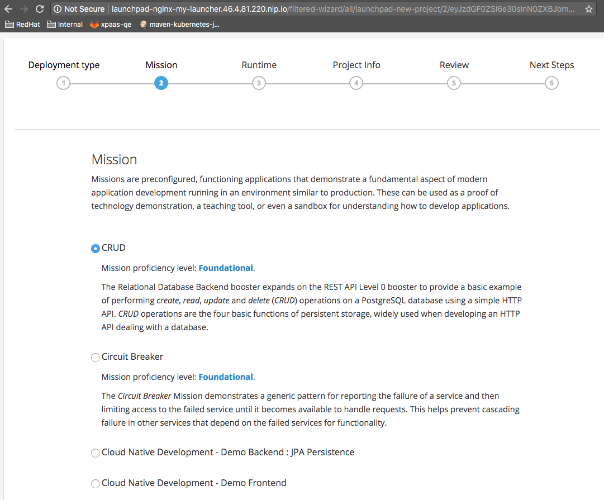

- Choose `Spring Boot Runtime`
- Accept the `Project Info`
- Finally click on the button Select `Download as zip file`
- Create a folder where you will develop your code
mkdir -p cloud-native-demo
```bash
mkdir -p cloud-native-demo
cd cloud-native-demo
```
- Unzip the generated project within the `cloud-native-demo` folder
```bash
cd cloud-native-demo
mv ~/Downloads/booster-demo-front-spring-boot.zip .
unzip booster-demo-front-spring-boot.zip
cd booster-demo-front-spring-boot
```

- Rename the `artifactId` of the pom.xml from `<artifactId>booster-demo-front-spring-boot</artifactId>` to
```xml
<artifactId>cloud-native-frontend</artifactId>
```

- Create `Note` pojo class under `src/main/java/me/snowdrop/cloudnative/front`
- Define these fields as well as their respective setters/getters 
```java
private Long id;
private String title;
private String content;
private Date createdAt;
private Date updatedAt;
```
- Add the interface `NoteGateway` within the same package
```java
public interface NoteGateway {
    ...
}
```
- Create the CRUD methods signature
```java
List<Note> all();
Note add(Note note);
Note update(Note note);
void delete(long id);
```
- Add a `NoteController` class within the same package `me.snowdrop.cloudnative.front`
- Add the following `Spring` annotations to specify the mapping to be used to expose the `note` service as REST endpoint
```java
@RestController
@RequestMapping("note")
```
- Add a `NoteGateway noteGateway` field and define it as `private final`
- Add constructor which accepts as parameter `NoteGateway noteGateway` and set within the body of the constructor the field `this.this.noteGateway`
- Create the CRUD / all, add, delete,update methods using as annotation respectively these values and return a `Note` or `List<Note>`
```java
@GetMapping
public List<Note> all()

@PutMapping
public Note add(@RequestBody Note note)

@DeleteMapping("/{id}")
public DefaultResult delete(@PathVariable("id") long id)

@PostMapping("/{id}")
public Note update(@PathVariable("id") long id, @RequestBody Note note)
```
- Implement the body of each CRUD method to return: 
  - `noteGateway.all();` content for `all` method
  - `noteGateway.add(note);` for `add(Note note)`
  - `noteGateway.update(note);` for `update(long id, Note note)`. Note that before calling `noteGateway.update(note);` `note.setId(id);` needs to be executed
  - `DefaultResult.INSTANCE` as response message for `delete(long id)`
  
The class `DefaultResult` also needs to be added as `private static` inside the `NoteController`

```java
    private static class DefaultResult {

        private final String result = "OK";

        public String getResult() {
            return result;
        }

        private static DefaultResult INSTANCE = new DefaultResult();

        private DefaultResult() {}
    }
```

- Compile the project
```bash
mvn clean compile
```

- Build and launch spring-boot application locally to ensure the application is working
```bash
mvn clean spring-boot:run 
```

- Open the following URL `http://localhost:8090` within a screen of your web browser

- Deploy the application on the cloud platform using the `s2i` build process
```bash
mvn package fabric8:deploy -Popenshift
```

- Open using the OpenShift UI console the `Routes` tab

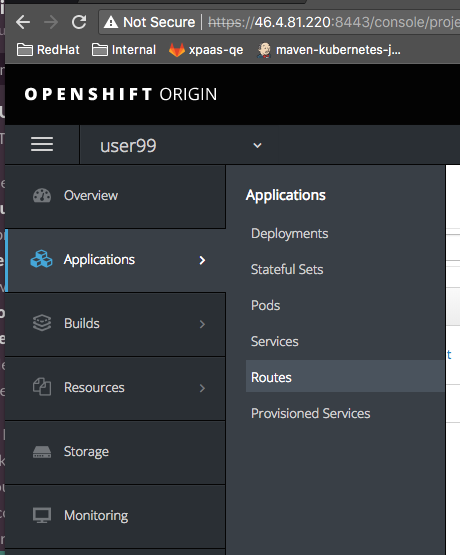

- And click on the url of your frontend app

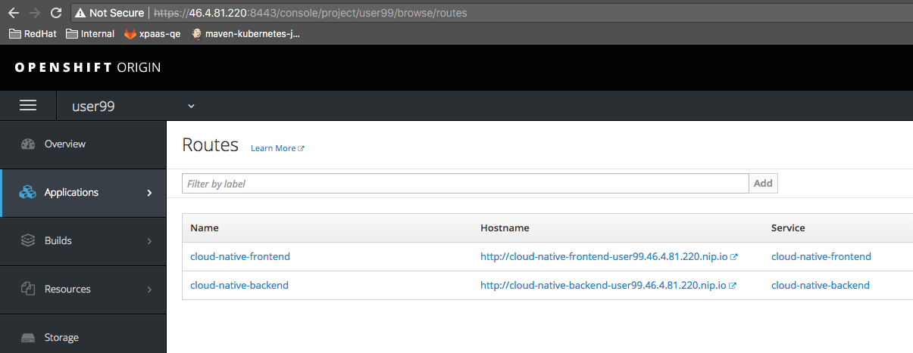

- Check that your `Cloud Native Frontend` is alive !

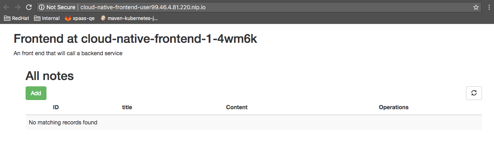

### Create a MySQL service instance using the Service Catalog

Time: 15min

Use the OpenShift Console to create a MySQL Service within your project and bind it. 

- Within your project, click on the `Browse catalog` button

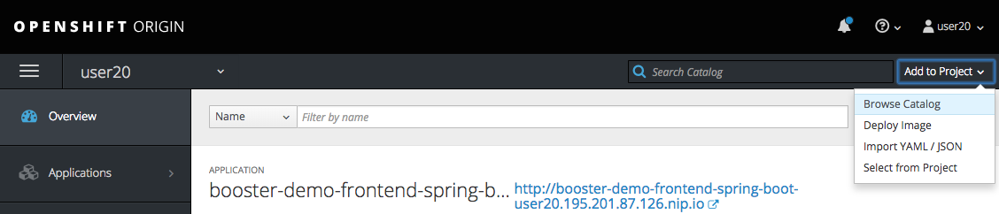

- Next select `MySQL (APB)` from the catalog

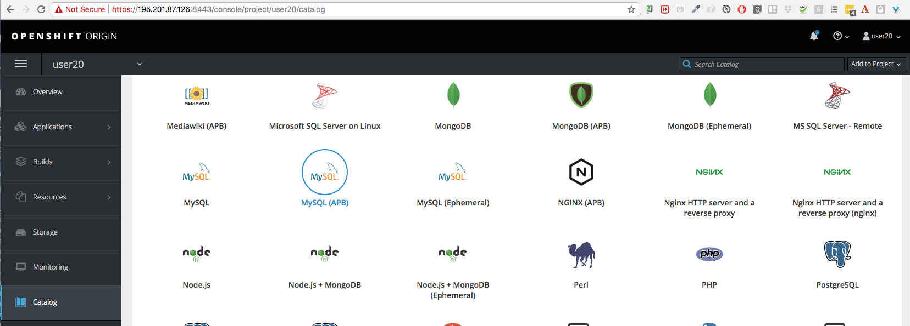

- Review the information of the database

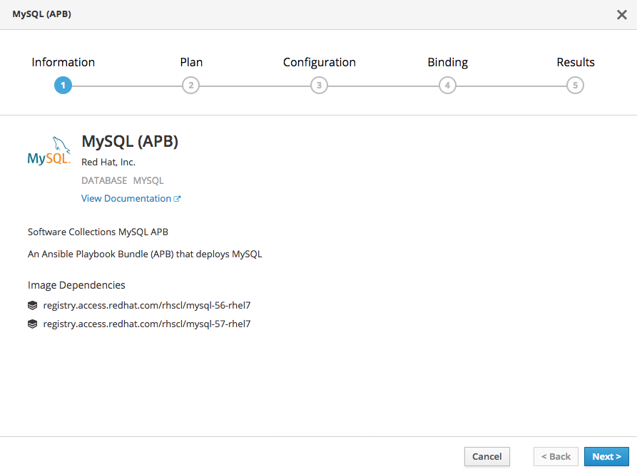

- Select `development` as plan per default


- Configure the service by selecting your project and database name `devel`
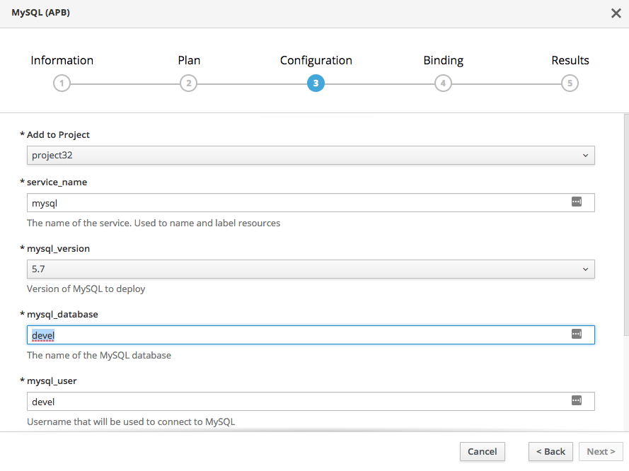

- Define the user `devel` and password `devel`

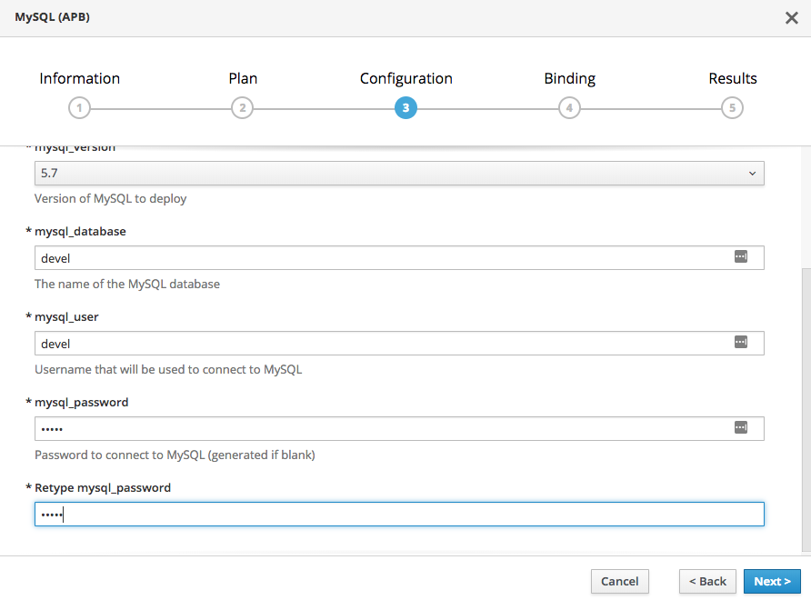

- Don't bind the service instance to generate the secret for the moment

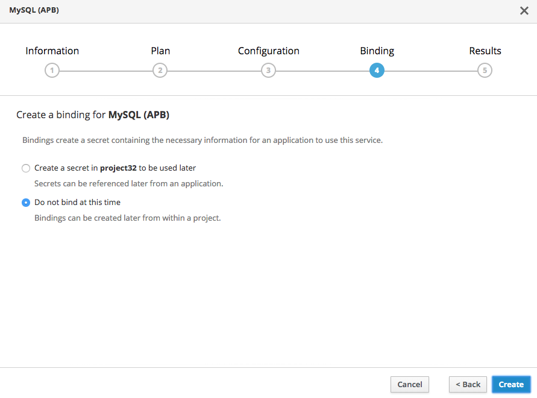

- Review the results of the creation of the service

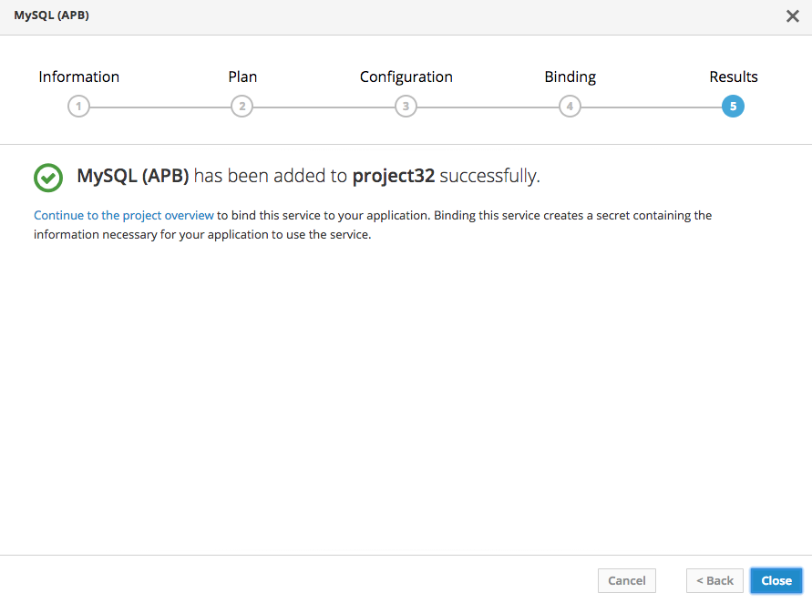

- After a few seconds, a MySQL database should be created within your project and provisioned

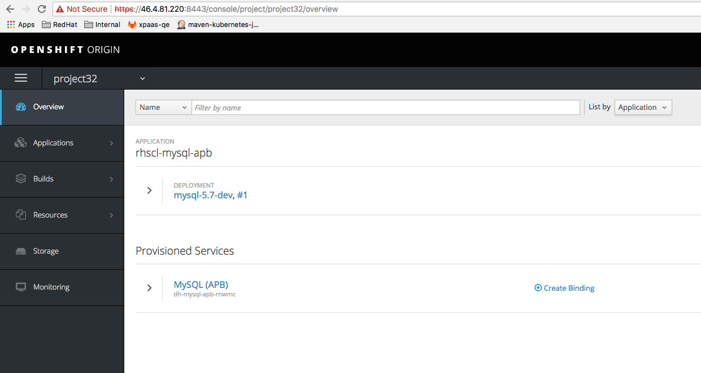

- Generate the secret from the service by clicking on the button `create binding`. The secret created will contain the database info to access it.
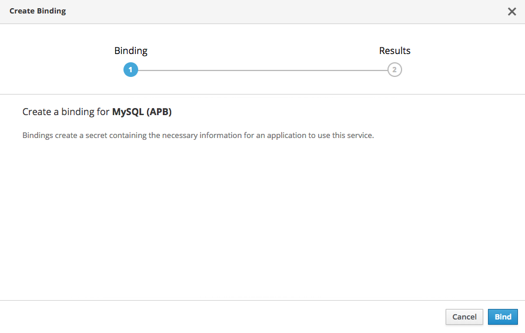

- Click on the button `bind` and review the results
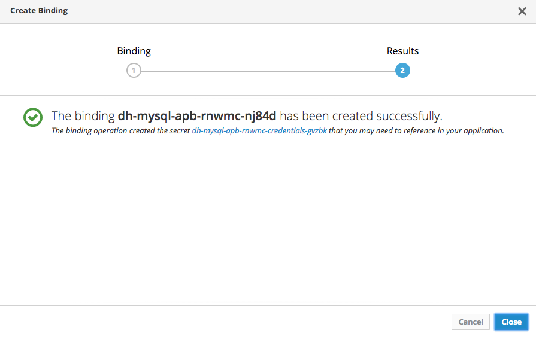

- The secret has been created and will be used later to mount it to the `cloud-native-backend` pod
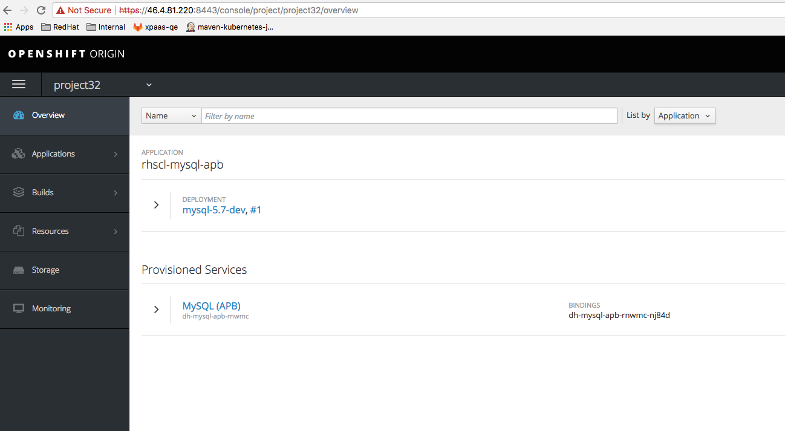

Remark : Alternatively, execute the following command within the `cloud-native-backend` project using the definition file provided in order to create a serviceInstance for MySQL

```bash
oc create -f openshift/mysql_serviceinstance.yml
```

### Use the launcher to generate a Cloud Native Demo - Backend zip

Time: 15min
   
- Access to the launcher using the following URL `http://launchpad-nginx-my-launcher.HETZNER_IP_ADDRESS.nip.io`
- From the `launcher application` screen, click on `launch` button
- Within the deployment type screen, click on the button `I will build and run locally`
- Next, select your mission : `Cloud Native Development - Demo Backend : JPA Persistence`


- Choose the `Spring Boot Runtime`
- Accept the `Project Info`
- Finally click on the button Select `Download as zip file`
- Unzip the project generated
```bash
cd cloud-native-demo
mv ~/Downloads/booster-demo-backend-spring-boot.zip .
unzip booster-demo-backend-spring-boot.zip
cd booster-demo-backend-spring-boot
```
- Build, launch spring-boot locally to test the in-memory H2 database
```bash
mvn clean spring-boot:run -Ph2 -Drun.arguments="--spring.profiles.active=local,--jaeger.sender=http://jaeger-collector-tracing.192.168.64.85.nip.io/api/traces,--jaeger.protocol=HTTP,--jaeger.port=0"
curl -k http://localhost:8080/api/notes 
curl -k -H "Content-Type: application/json" -X POST -d '{"title":"My first note","content":"Spring Boot is awesome!"}' http://localhost:8080/api/notes 
curl -k http://localhost:8080/api/notes/1
```

- Deploy the application on the cloud platform using the `s2i` build process
```bash
oc new-app -f openshift/cloud-native-demo_backend_template.yml
```

- Start the build using project's source
  
```bash
oc start-build cloud-native-backend-s2i --from-dir=. --follow
```
- Wait until both the build and deployment are done !
- As the pod of the backend doesn't yet has the info to access the database (and therefore can't correctly configure  its datasource), the application will report errors within the log of the console.
- Then, from the left menu bar of the console, select `Resources/Secrets` to list the secrets

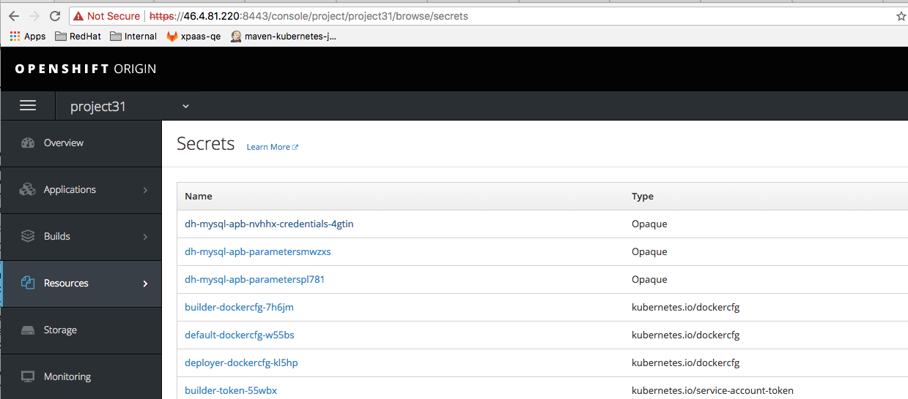

- Select the secret created previously and containing `credentials` word within its name. Click on the name of the secret.
- Click on the button `Add to application`. Select from the drop down list your cloud-backend application and click on the save button


- Next, open the `Applications/Deployments` view and verify that a second deployment of the has been triggered

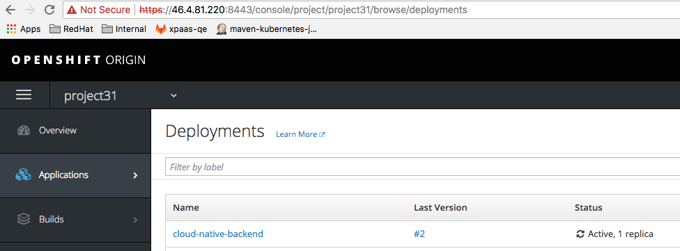

Remark: If you prefer to do the job without using the console, then execute the following oc commands

- Bind the credentials of the ServiceInstances to a Secret

```bash
oc create -f openshift/mysql-secret_servicebinding.yml
```

- Next, mount the secret of the MySQL service to the `Deploymentconfig` of the backend

```bash
oc env --from=secret/spring-boot-notes-mysql-binding dc/cloud-native-backend
```

- Wait in both cases until the pod is recreated and then test the service


```bash
export BACKEND=$(oc get route/cloud-native-backend -o jsonpath='{.spec.host}' -n $(oc project -q))
curl -k $BACKEND/api/notes 
curl -k -H "Content-Type: application/json" -X POST -d '{"title":"My first note","content":"Spring Boot is awesome!"}' $BACKEND/api/notes 
curl -k $BACKEND/api/notes/1
```

Remark : if the Lab is deployed on Minishift, then you can get the route using this command `#export BACKEND=$(minishift openshift service cloud-native-backend -n cnd-demo --url)`

### Debug your application

Time: 10min

- Edit the `deploymentConfig` of the `cloud-native-frontend` to add this env parameter and redeploy the pod

```yaml
- name: JAVA_ENABLE_DEBUG
  value: 'true'
```

- Get the `NAME_OF_THE_POD`
```bash
oc get pods -lapp=cloud-native-frontend
NAME                         READY     STATUS    RESTARTS   AGE
cloud-native-frontend-2-ck9lz   1/1       Running   0          1m
```
- Next run this `oc` command to forward the pod traffic of the port `5005` to your local remote debugger running at the address `localhost:5005`
```bash
oc port-forward NAME_OF_POD 5005:5005
```
- Add a breakpoint within the `NoteController` class at the method `getAll`

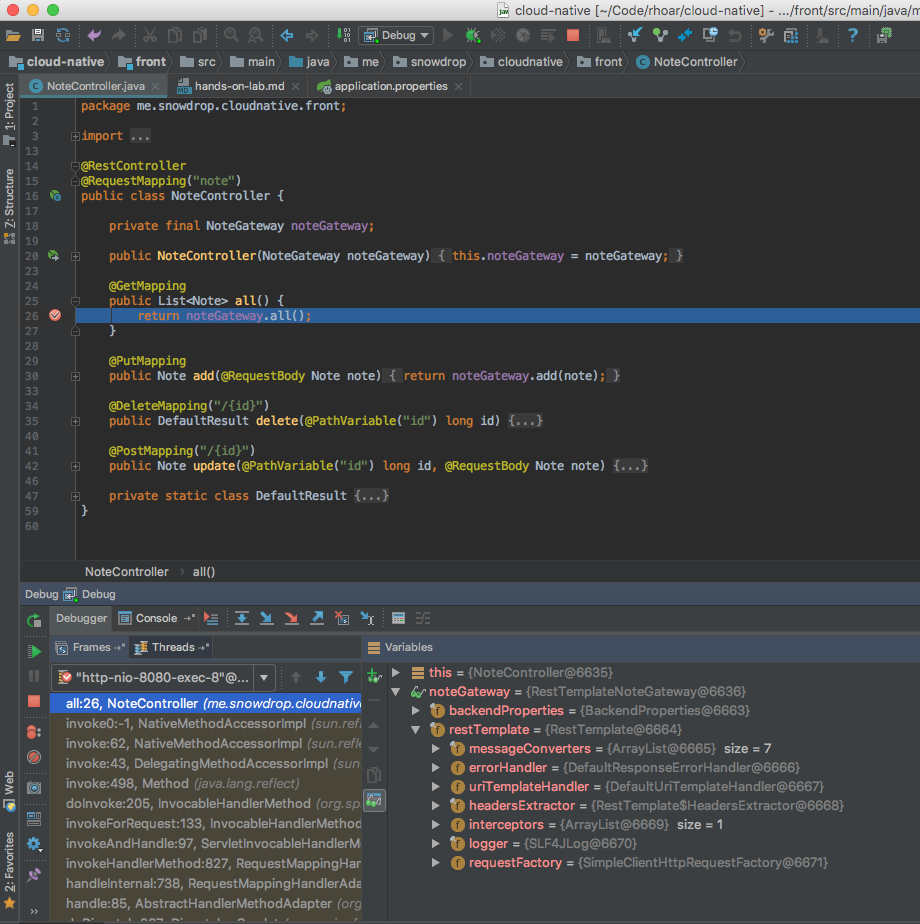

- Configure a remote debugger into your IDE

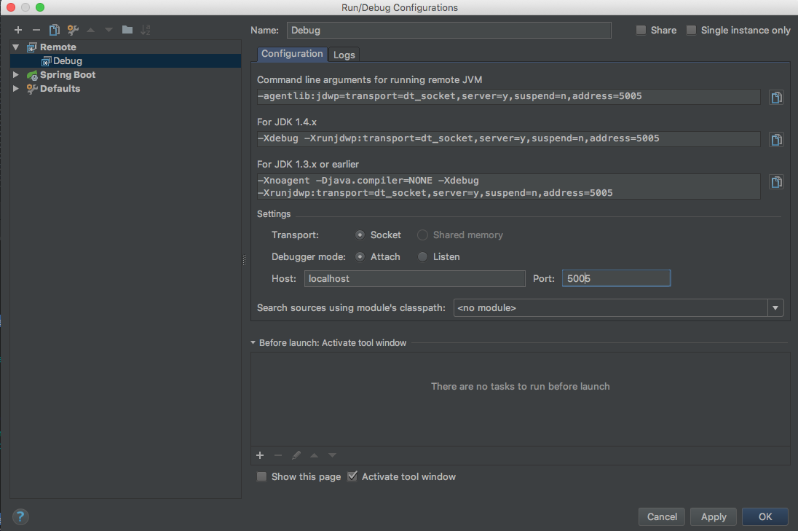

- Start your remote debugger locally at the address `5005`
- Open the front application within your web browser and click on the button to get all the notes
- Then your remote debugger should stop at the line where the breakpoint has been added


### Develop an Arquillian Cube Test

Time: 20min

- Add Arquillian dependencies to the pom.xml file of the `cloud-native-backend` project
```xml
<dependency>
	<groupId>org.jboss.arquillian.junit</groupId>
	<artifactId>arquillian-junit-container</artifactId>
	<scope>test</scope>
</dependency>
<dependency>
	<groupId>org.arquillian.cube</groupId>
	<artifactId>arquillian-cube-openshift</artifactId>
	<scope>test</scope>
	<exclusions>
		<exclusion>
			<groupId>io.undertow</groupId>
			<artifactId>undertow-core</artifactId>
		</exclusion>
	</exclusions>
</dependency>
```

- Create an `LocalTest` class and specify the field `NoteRepository`. Annotate it with the annotation `@Autowired`
```java
public class LocalTest {

    @Autowired
    protected NoteRepository noteRepository;
}
```

- Next, create 2 methods `testGetEmptyArray` and `testGetOneNote` to test the Note backend

```java
    @Test
    public void testGetEmptyArray() {
        when().get()
                .then()
                .statusCode(200)
                .body(is("[]"));
    }


    @Test
    public void testGetOneNote() {
        Note cherry = new Note();
        cherry.setContent("cherry");
        cherry.setTitle("excellent");
        noteRepository.save(cherry);

        when().get(String.valueOf(cherry.getId()))
                .then()
                .statusCode(200)
                .body("id", is(cherry.getId().intValue()))
                .body("content", is(cherry.getContent()))
                .body("title", is(cherry.getTitle()));
    }
```

- Configure Junit using the annotation `@Runwith` to use `SpringRunner`. The annotation should be added at the class level.
```java
@RunWith(SpringRunner.class)
```

- Tell to Spring Boot Test to use a random port. The annotation should be added at the class level.
```java
@SpringBootTest(webEnvironment = SpringBootTest.WebEnvironment.RANDOM_PORT)
```

- Set the field to use the local random port
```java
    @Value("${local.server.port}")
    private int port;
```

- Define the URL of the endpoint to test using `RestAssured.baseURI`
```java
    @Before
    public void beforeTest() {
        noteRepository.deleteAll();
        RestAssured.baseURI = String.format("http://localhost:%d/api/notes", port);
    }
```

- Test the `LocalTest` Junit class
```bash
mvn clean test
```

- Create the `OpenShiftIT` which will contain the code to test the deployed backend service over it's REST endpoints
```java
public class OpenShiftIT {
    
}
```

- Configure Junit using the annotation `@Runwith` to use `Arquillian`. The annotation should be added at the class level.
```java
@RunWith(Arquillian.class)
```

- Add the `baseURL` field and specify the following annotations
```java
    @AwaitRoute(path = "/health")
    @RouteURL("cloud-native-backend")
    public URL baseURL;
```

Remark: The RouteURL is used by arquillian to access the service deployed on the cloud platform
The `@AwaitRule` annotation is used in order for Arquillian to wait until the application has stood up properly

- Configure `RestAssured.baseURI` to use the baseURL followed by the address of the endpoint
```java
    @Before
    public void setup() throws Exception {
        RestAssured.baseURI = baseURL + "api/notes";
    }
```

- Finally create the actual test code

```java
    @Test
    public void testPostGetAndDelete() {
        //create a new note
        Integer id = given()
                .contentType(ContentType.JSON)
                .body(new HashMap<String, String>() {{
                    put("title", "excellent");
                    put("content", "cherry");
                }})
                .when()
                .post()
                .then()
                .statusCode(200)
                .body("id", not(isEmptyString()))
                .body("title", CoreMatchers.is("excellent"))
                .extract()
                .response()
                .path("id");

        //fetch the note by id
        when().get(id.toString())
                .then()
                .statusCode(200)
                .body("id", CoreMatchers.is(id))
                .body("title", CoreMatchers.is("excellent"));

        //delete the note
        when().delete(id.toString())
                .then()
                .statusCode(200);
    }
```

- Create an `arquillian.xml` file under `src/main/resources` folder containing such parameters
```xml
<arquillian xmlns:xsi="http://www.w3.org/2001/XMLSchema-instance"
            xmlns="http://jboss.org/schema/arquillian"
            xsi:schemaLocation="http://jboss.org/schema/arquillian http://jboss.org/schema/arquillian/arquillian_1_0.xsd">

  <extension qualifier="openshift">
    <property name="namespace.use.current">true</property>
    <property name="env.init.enabled">false</property>
    <property name="enableImageStreamDetection">false</property>
  </extension>

</arquillian>
```

- Test the Integration Test using this command

```bash
mvn clean verify -Popenshift-it
```

### Use Distributed Tracing to collect app traces

Time : 15min

As we have decomposed the application into 2 microservices, then we will deploy the technology which is required to collect the logs/traces 
from the different spring boot applications and to aggregate them using a Distributed Tracer backend. 
We will use the OpenTracing specification implemented by the [Jaeger]() project and available using the [Spring Boot Jaeger starter]()
For that purpose we will modify the existing applications to instrument them with the Spring Boot Jaeger.

- Verify that the pom file contains the `Spring Boot Jaeger starter` dependency
```xml
<!-- OpenTracing -->
<dependency>
	<groupId>me.snowdrop</groupId>
	<artifactId>opentracing-tracer-jaeger-spring-web-starter</artifactId>
	<version>0.1</version>
</dependency>
```

- Update the `Deploymentconfig` of your `cloud-native-backend` project in order to pass these env variables
```yaml
   - name: OPENTRACING_JAEGER_HTTP_SENDER_URL
     value: http://jaeger-collector-infra.svc:14268/api/traces
   - name: OPENTRACING_JAEGER_SERVICE_NAME
     value: cloud-native-backend-YOUR_PROJECT
```

Remark : you can get your project name using this command `$(oc project -q)`

- Safe the `Deploymentconfig` and check if the pod has been recreated using this oc command
```bash
oc get pods -w
```

- Open within your browser the url/address of the `jaeger` query - `https://jaeger-query-infra.HETZNER_IP.nip.io/`
- Select your project from the list and click on the button `Find traces`

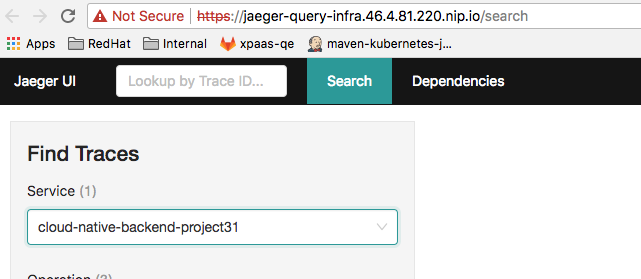

- Using the `cloud-native-frontend` application, send requests against the backend to fetch data from the database by clicking on the refresh `button`
- Check within the collector screen that traces have been generated

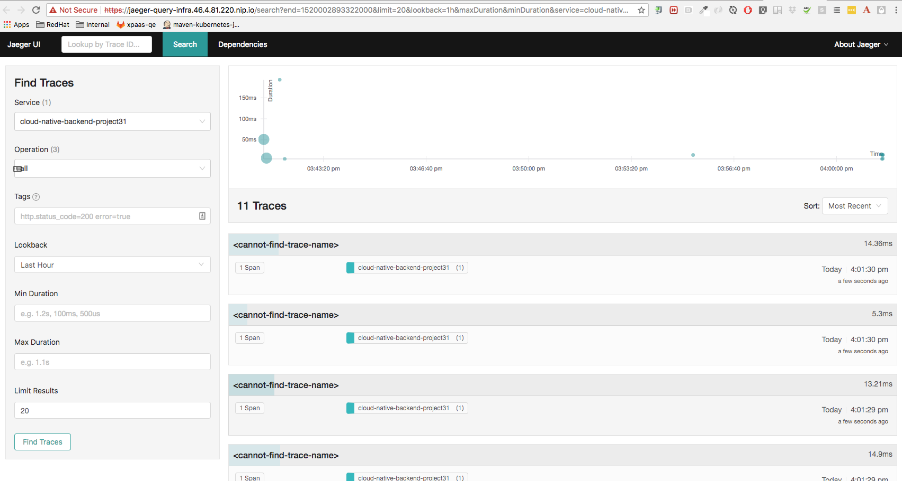

### Show case horizontal scaling

Time : 5min

The OpenShift platform offers a horizontal scaling feature that we will use within this module of the lab in order
to expose behind the `cloud-native-frontend` router address 2 pods. By opening the address of the route of the front application,
you will be able to see the `pod-name` returned which corresponds to one of the pod load balanced by the Kubernetes API.

- In order to showcase/demo horizontal scaling, then you will execute the following `oc` command to scale the DeploymentConfig
  of the `cloud-native-frontend application`

```bash
oc scale --replicas=2 dc cloud-native-frontend
```

- Then, verify that 2 pods are well running

```bash
oc get pods -l app=cloud-native-frontend
NAME                         READY     STATUS    RESTARTS   AGE
cloud-native-frontend-1-2pnbb   1/1       Running   0          3h
cloud-native-frontend-1-cc44g   1/1       Running   0          4h
```

- Next, open 2 Web browsers or curl to check that you get a response from on of the round robin called pod

```bash
curl -v http://cloud-native-frontend-PROJECT_NAME.HETZNER_IP.nip.io/ | grep 'id="_http_booster"'
<h2 id="_http_booster">Frontend at cloud-native-frontend-1-2pnbb</h2>
curl -v http://cloud-native-frontend-PROJECT_NAME.HETZNER_IP.nip.io/ | grep 'id="_http_booster"'
<h2 id="_http_booster">Frontend at cloud-native-frontend-1-cc44g</h2>
```

### S2I Build using pipeline

Tome : 15min

The Source to Image strategy - aka `s2i` proposes different strategies to build a project on OpenShift. During the previous hands on lab modules, we have 
used either the mode `Binary` or `Git` as the source of the project to be build by the `s2i` bash script of the image `redhat-openjdk-1.8`.

During this module, you will use the `Pipeline` strategy where a `Jenkinsfile` containing the build scenario will be created using `Groovy syntax`
for Jenkins. This file will be deployed on the platform as a new `BuildConfig` in order to ask that Jenkins creates a Job running within a `jnlp java client container`
the scenario defined as `groovy` script.

- Create a `Jenkinsfile` under the `cloud-native-backend` project

```bash
cat > Jenkinsfile <<'EOL'
podTemplate(name: 'maven33', label: 'maven33', cloud: 'openshift', serviceAccount: 'jenkins', containers: [
    containerTemplate(name: 'jnlp',
        image: 'openshift/jenkins-slave-maven-centos7',
        workingDir: '/tmp',
        envVars: [
            containerEnvVar(key: 'MAVEN_MIRROR_URL',value: 'http://nexus.infra.svc:8081/nexus/content/groups/public/'),
        ],
        cmd: '',
        args: '${computer.jnlpmac} ${computer.name}')
]){
  node("maven33") {
    checkout scm
    // git url: 'https://github.com/snowdrop/cloud-native-backend.git'
    stage("Test") {
      sh "mvn test"
    }

    stage("Use appropriate namespace") {
        sh "oc project ${OPENSHIFT_NAMESPACE}"
    }

    stage("Deploy") {
      sh "sed -e 's/changeme/${env.OPENSHIFT_NAMESPACE}/g' src/main/fabric8/dc.yaml -i"
      sh "mvn  -Popenshift -DskipTests clean fabric8:deploy"
    }
  }
}
EOL
```

- Then delete the previously created buildConfig resource

```bash
oc delete bc/cloud-native-backend-s2i 
```

- Create a script that can be leveraged to automatically create the pipeline build config

```bash
cat > create-pipeline.sh <<'EOL'
#!/usr/bin/env bash

# Creates jenkins pipeline for a namespace
# The only argument passed to the script is the namespace / project into which the pipeline BC will be created
# If no argument is passed, it's assumed that the namespace to be used is the current namespace

# The script assumes that oc login has been performed

namespace=${1:-$(oc project -q)}

substituted_var_filename=jenkins-bc-temp.yml

# change the namespace placeholder
sed -e "s/changeme/${namespace}/g" openshift/jenkins-bc.yaml > ${substituted_var_filename}

# actually create the JenkinsPipeline BuildConfig
oc apply -f ${substituted_var_filename}

# remove temporary file
rm ${substituted_var_filename}


EOL
```

```bash
chmod +x create-pipeline.sh
```

- Create the new build

```bash
./create-pipeline.sh
```

- Start the new build

```bash
oc start-build cloud-native-backend-$(oc project -q)
```

- Open your project within the OpenShift console and select `Pipelines` under the `Build` screen
- Look to your pipeline created and check if the build has been started
- Click on the link `view log` to access to the `jenkins job console`
- When you will access to the `jenkins` server, then use your `user/password` to log on 
- Click on the button `Allow selected permissions`

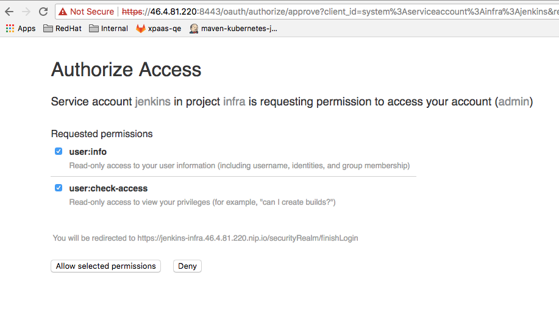

- Log on again with your user/password
- Consult the output of the build within the job screen

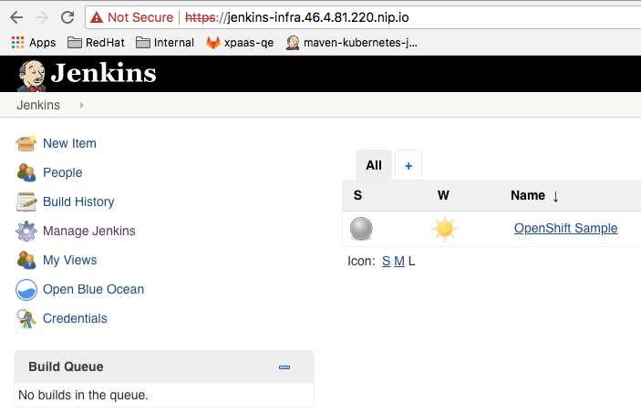

- To see the progression of the pipeline created and started, then open the OpenShift UI console and move to the tab `Builds/Pipelines`

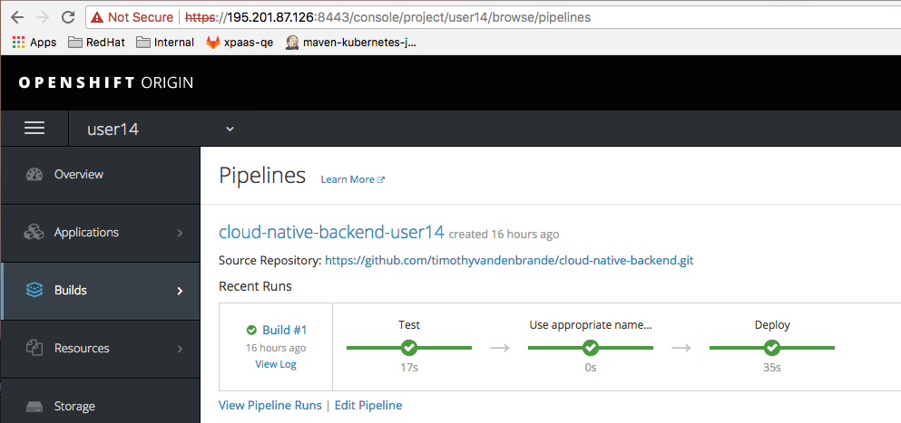

- When the build is finished, select within your OpenShift Console the `overview` screen and access to the newly pod created


# How to share your feedback

As we need your help to improve the `Cloud Native Development and Experience` that we are currently developing for you, please report a ticket using github issue
and tag your ticket using the label `feedback` under `https://github.com/snowdrop/cloud-native-lab`

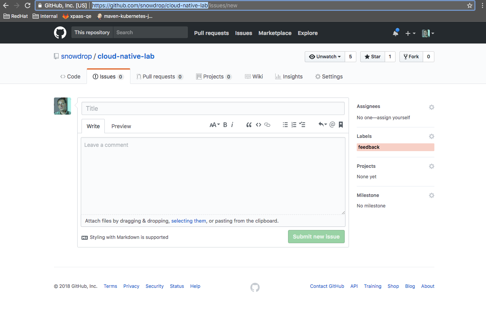

# Lab material for instructors

- [Cloud Native Front](https://github.com/snowdrop/cloud-native-front)
- [Cloud Native Backend](https://github.com/snowdrop/cloud-native-backend)
- [Launcher catalog](https://github.com/snowdrop/cloud-native-catalog)
- [Lab](https://github.com/snowdrop/cloud-native-lab)


