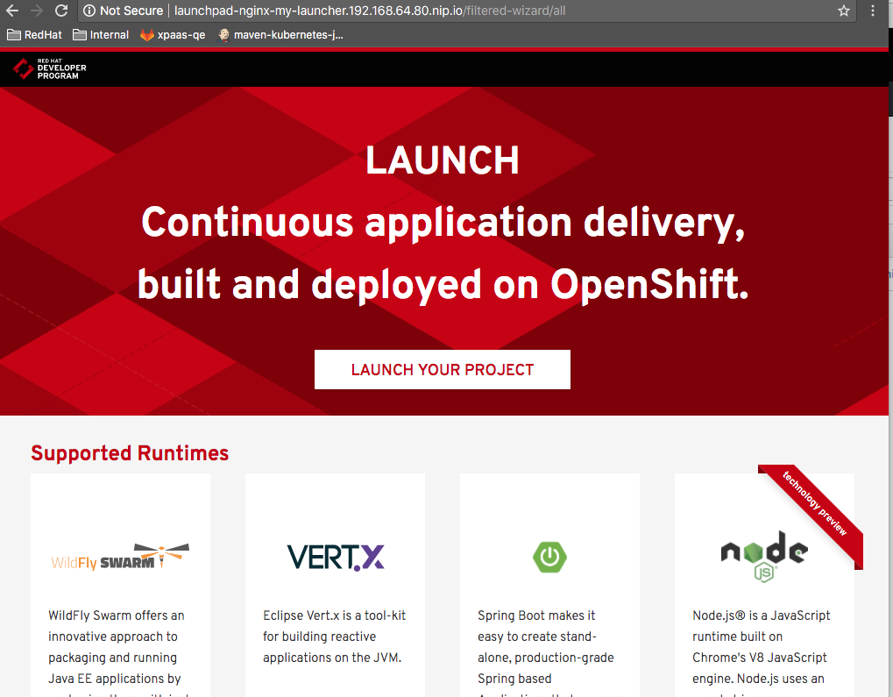
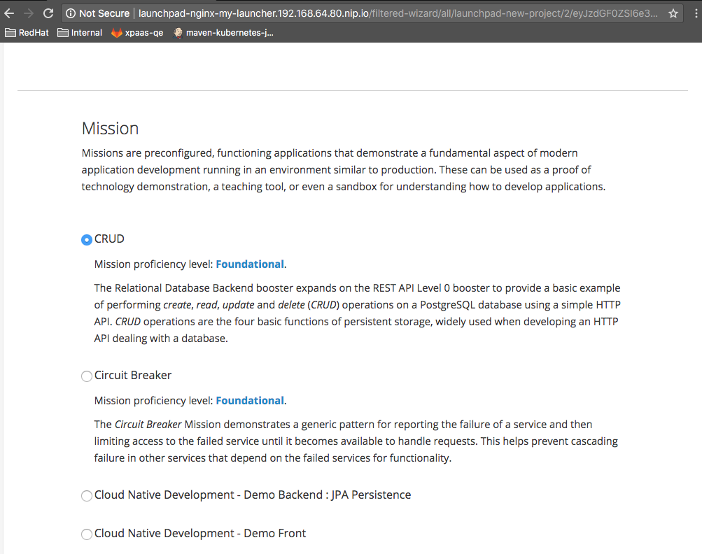
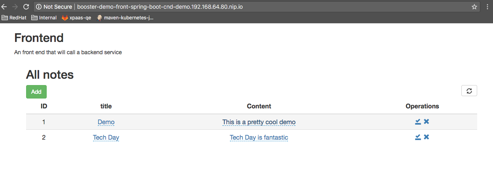

# Hands On Lab instructions for the Cloud Native Development

TODO - Add ToC (using gh-md-toc hands-on-lab.md)
* [Requirements](#requirements)
* [Objectives](#objectives)
    * [All users to recommendations:v2](#all-users-to-recommendationsv2)

## Requirements

1. Java - 1.8.x

2. Maven - 3.5.x

3. OpenShift oc client - [3.7.0](TODO)

## Lab Scenario

The purpose of this lab is to develop and deploy 2 microservices on the OpenShift platform; a front and backend and to use a MySQL Database which has been provisioned as a service.
The `objectives` section defined hereafter summarizes the features that you will play with this Hands On Lab material.

## Objectives

- Discover OpenShift Cloud Platform
- Play with the different strategies to build a project on the platform
- Develop a real application (front, backend, database)
- Use Service Catalog to instantiate a service
- Debug a microservice
- Design a JUnit Integration test using Arquillian Cube
- Enable Distributed Tracing
- Use Jenkins CI/CD and Pipeline

### Discover the OpenShift platform

Time: 15min

- Open the OpenShift Cluster within your browser and verify that you can log on to the machine using your user/pwd

Remark: Use the user/pwd and IP address assigned to you

- Get the token from the `command-line` screen using this URL `https://HETZNER_IP_ADDRESS:8443/console/command-line`
- Next, execute this command within your terminal to access to the cluster using your `oc` client tool

```bash
oc login https://HETZNER_IP_ADDRESS:8443 --token=3WiSqc3JyW5dkJ5izQvOBVFK-njXTTnpse8ruLiYaoQ
Logged into "https://HETZNER_IP_ADDRESS:8443" as "user1" using the token provided.

You have one project on this server: "project1"

Using project "project1".
```

- Check the status of the project

```bash
oc status
In project project1 on server https://HETZNER_IP_ADDRESS:8443

You have no services, deployment configs, or build configs.
Run 'oc new-app' to create an application.
```

- Familiarize your self with the `oc` client and look to the different commands

```bash
oc -h
```

### Generate Spring Boot Cloud Native Front project using the launcher

Time: 30 min

- Access to the launcher using the following URL `https://launchpad-my-launcher.HETZNER_IP_ADDRESS.nip.io`
- From the `launcher application` screen, click on `launch` button



- Within the deployment type screen, click on the button `I will build and run locally`
- Next, select your mission : `Cloud Native Development - Demo Front`



- Choose `Spring Boot Runtime`
- Accept the `Project Info`
- Finally click on the button Select `Download as zip file`
- Create a folder where you will develop your code
mkdir -p cloud-native-demo
```bash
mkdir -p cloud-native-demo
cd cloud-native-demo
```
- Unzip the generated project within the `cloud-native-demo` folder
```bash
cd cloud-native-demo
mv ~/Downloads/booster-demo-front-spring-boot.zip .
unzip booster-demo-front-spring-boot.zip
cd booster-demo-front-spring-boot
```

- Create `Note` pojo class under `src/main/java/me/snowdrop/cloudnative/front`
- Define these fields as setter/getter 
```java
private Long id;
private String title;
private String content;
private Date createdAt;
private Date updatedAt;
```

- Add a `NoteController` class within the same package `me.snowdrop.cloudnative.front`
- Add these `Spring` annotations to specify the mapping to be used to expose the `note` service as REST endpoint
```java
@RestController
@RequestMapping("note")
```
- Add a `NoteGateway noteGateway` field and define it as `private final`
- Add constructor which accepts as parameter `NoteGateway noteGateway` and set within the body of the constructor the field `this.this.noteGateway`
- Create the CRUD / all, add, delete,update methods using as annotation respectively these values and return a `Note` or `List<Note>`
```java
@GetMapping
public List<Note> all()

@PutMapping
public Note add(@RequestBody Note note)

@DeleteMapping("/{id}")
public DefaultResult delete(@PathVariable("id") long id)

@PostMapping("/{id}")
public Note update(@PathVariable("id") long id, @RequestBody Note note)
```
- Implement the body of each CRUD method to return: 
  - `noteGateway.all();` content for `all` method
  - `noteGateway.add(note);` for `add(Note note)`
  - `noteGateway.update(note);` for `update(long id, Note note)`
  - `OK` as response message for `long id)`

- Add the interface `NoteGateway` within the saame package
```java
public interface NoteGateway {
    ...
}
```
- Create the CRUD methods signature
```java
List<Note> all();
Note add(Note note);
Note update(Note note);
void delete(long id);
```

- Compile the project
```java
mvn clean compile
```

- Build and launch spring-boot application locally to ensure the application is working
```bash
mvn clean spring-boot:run 
```

- Open the following URL `http://localhost:8090` within a screen of your web browser

- Deploy the application on the cloud platform using the `s2i` build process
```bash
mvn package fabric8:deploy -Popenshift
```

### Create a MySQL service instance using the Service Catalog

Time: 15min

! Use the Web UI to create the Service and bind it. 
Alternatively, execute the following command using the definition file provided with the backend application (which is the subject of the next step) in order to create a serviceInstance for MySQL

```bash
oc create -f openshift/mysql_serviceinstance.yml
```

TODO - Add screenshots

### Use the launcher to generate a Cloud Native Demo - Backend zip

Time: 15min
   
- Access to the launcher using the following URL `https://launchpad-my-launcher.HETZNER_IP_ADDRESS.nip.io`
- From the `launcher application` screen, click on `launch` button
- Within the deployment type screen, click on the button `I will build and run locally`
- Next, select your mission : `Cloud Native Development - Demo Backend : JPA Persistence`


- Choose the `Spring Boot Runtime`
- Accept the `Project Info`
- Finally click on the button Select `Download as zip file`
- Unzip the project generated
```bash
cd cloud-native-demo
mv ~/Downloads/booster-demo-backend-spring-boot.zip .
unzip booster-demo-backend-spring-boot.zip
cd booster-demo-backend-spring-boot
```
- Build, launch spring-boot locally to test the in-memory H2 database
```bash
mvn clean spring-boot:run -Ph2 -Drun.arguments="--spring.profiles.active=local,--jaeger.sender=http://jaeger-collector-tracing.192.168.64.85.nip.io/api/traces,--jaeger.protocol=HTTP,--jaeger.port=0"
curl -k http://localhost:8080/api/notes 
curl -k -H "Content-Type: application/json" -X POST -d '{"title":"My first note","content":"Spring Boot is awesome!"}' http://localhost:8080/api/notes 
curl -k http://localhost:8080/api/notes/1
```

- Deploy the application on the cloud platform using the `s2i` build process
```bash
oc new-app -f openshift/cloud-native-demo_backend_template.yml
```

- Start the build using project's source
  
```bash
oc start-build cloud-native-backend-s2i --from-dir=. --follow
```
- Wait until the build and deployment complete !!

- Bind the credentials of the ServiceInstances to a Secret

```bash
oc create -f openshift/mysql-secret_servicebinding.yml
```

TODO - Add screenshots

- Next, mount the secret of the MySQL service to the `Deploymentconfig` of the backend

```bash
oc env --from=secret/spring-boot-notes-mysql-binding dc/cloud-native-backend
```

TODO - Add screenshots

**NOTE**: If you create the service using the UI, then find the secret name of the DB and next click on the `add to application` button
to add the secret to the Deployment Config of your application

- Wait until the pod is recreated and then test the service



```bash
#export BACKEND=$(oc get route/cloud-native-backend -o jsonpath='{.spec.host}' -n cnd-demo)
export BACKEND=$(minishift openshift service cloud-native-backend -n cnd-demo --url)
curl -k $BACKEND/api/notes 
curl -k -H "Content-Type: application/json" -X POST -d '{"title":"My first note","content":"Spring Boot is awesome!"}' $BACKEND/api/notes 
curl -k $BACKEND/api/notes/1
```

### Debug your application

Time: 10min

- Edit the `deploymentConfig` to add this env parameter and redeploy the pod

```yaml
- name: JAVA_ENABLE_DEBUG
  value: 'true'
```

- Next run this `oc` command to forward the port traffic to the port exposed by the remote debuggerr
```bash
oc port-forward NAME_OF_POD 5005:5005
```

- Add a breakpoint within the `NoteController` class at the method `getAll`

TODO: Add image

- Start your remote debugger locally at the address `5005`
- Open the front within your web browser and click on the button to get all the notes
- Then your remote debugger should stop at the line where the breakpoint has been included

### Develop an Arquillian Cube Test

Time: 20min


### Use Distributed Tracing to collect app traces

Time : 15min

As we have decomposed the application into 2 microservices, then we will deploy the technology which is required to collect the logs/traces 
from the different spring boot applications and to aggregate them using a Distributed Tracer backend. 
We will use the OpenTracing specification implemented by the [Jaeger]() project and available using the [Spring Boot Jaeger starter]()
For that purpose we will modify the existing applications to instrument them with the Spring Boot Jaeger.

TODO : Check to use only one instance of Jaeger

- Install Jaeger on OpenShift to collect the traces

```bash
oc new-project tracing
oc process -f https://raw.githubusercontent.com/jaegertracing/jaeger-openshift/master/all-in-one/jaeger-all-in-one-template.yml | oc create -f -
```

- Create a route to access the Jaeger collector

```bash
oc expose service jaeger-collector --port=14268 -n tracing
```

- Specify next the url address of the Jaeger Collector to be used
- Get the route address

```bash
oc get route/jaeger-collector --template={{.spec.host}} -n tracing 
```
    
- Open the pom file and add the `Spring Boot JAeger starter` dependency
```xml
<!-- OpenTracing -->
<dependency>
	<groupId>me.snowdrop</groupId>
	<artifactId>opentracing-tracer-jaeger-spring-web-starter</artifactId>
	<version>0.0.1-SNAPSHOT</version>
</dependency>
```
    
- Add the following jaeger properties to the application.yml file with the route address of the collector

```yaml
jaeger:
  protocol: HTTP
  sender: http://jaeger-collector-tracing.HETZNER_IP_ADDRESS.nip.io/api/traces
```

- Redeploy your project / spring boot backend on the cloud platform
```bash
mvn clean package
oc start-build cloud-native-backend-s2i --from-dir=. --follow
```

- Check if the pod has been recreated using this oc command
```bash
oc get pods -w
```

- Open within your browser the url/address of the `jaeger` collector - `https://jaeger-collector-infra.HETZNER_IP.nip.io`
- Using the `cloud-native-front` application, issue send requests against the backend to fetch from the database some `notes`
- Check within the collector screen that traces have been generated

TODO : Add screenshots

### Show case horizontal scaling

Time : 5min

The OpenShift platform offers a horizontal scaling feature that we will use within this module of the lab in order
to expose behind the `cloud-native-front` router address 2 pods. By opening the address of the route of the front application,
you will be able to see the `pod-name` returned which corresponds to one of the pod loadbalanced by the Kubernetes API.

- In order to showcase/demo horizontal scaling, then you will execute the following `oc` command to scale the DeploymentConfig
  of the `cloud-native-front application`

```bash
oc scale --replicas=2 dc cloud-native-front
```

- Then, verify that 2 pods are well running

```bash
oc get pods -l app=cloud-native-front
NAME                         READY     STATUS    RESTARTS   AGE
cloud-native-front-1-2pnbb   1/1       Running   0          3h
cloud-native-front-1-cc44g   1/1       Running   0          4h
```

- Next, open 2 Web browsers or curl to check that you get a response from on of the round robin called pod

```bash
http -v http://cloud-native-front-cnd-demo.192.168.64.80.nip.io/ | grep 'id="_http_booster"'
<h2 id="_http_booster">Frontend at cloud-native-front-1-2pnbb</h2>
http -v http://cloud-native-front-cnd-demo.192.168.64.80.nip.io/ | grep 'id="_http_booster"'
<h2 id="_http_booster">Frontend at cloud-native-front-1-cc44g</h2>
```

### S2I Build using pipeline

Tome : 15min

The Source to Image strategy - aka `s2i` proposes different strategies to build a project on OpenShift. During the previous hands on lab modules, we have 
used either the mode `Binary` or `Git` as the source of the project to be build by the `s2i` bash script of the image `redhat-openjdk-1.8`.

During this module, you will use the `Pipeline` strategy where a `Jenkinsfilke` containing the build scenario will be created using `Groovy syntax`
for Jenkins. This file will be deployed on the platform as a new `BuildConfig` in order to ask that Jenkins creates a Job running within a `jnlp java client container`
the scenario defined as `groovy` script.

- Create a `jenkinsfile` under the `cloud-native-backend` project

```bash
cat > jenkinsfile <<'EOL'
podTemplate(name: 'maven33', label: 'maven33', cloud: 'openshift', serviceAccount: 'jenkins', containers: [
    containerTemplate(name: 'jnlp',
        image: 'openshift/jenkins-slave-maven-centos7',
        workingDir: '/tmp',
        envVars: [
            envVar(key: 'MAVEN_MIRROR_URL',value: 'http://nexus-myproject.HETZNER_IP.nip.io/nexus/content/groups/public/')
        ],
        cmd: '',
        args: '${computer.jnlpmac} ${computer.name}')
]){
  node("maven33") {
    checkout scm
    stage("Test") {
      sh "mvn test"
    }
    stage("Deploy") {
      sh "mvn  -Popenshift -DskipTests clean fabric8:deploy"
    }
  }
}
EOL
```

- Then delete the previously created buildConfig resource

```bash
oc delete bc/cloud-native-backend
```

- Create a new build

```bash
oc new-build --strategy=pipeline https://github.com/snowdrop/cloud-native-backend.git
```

- Open your project within the OpenShift console and select `Pieplines` under the `Build` screen
- Look to your pipeline created and check if the build has been started
- Click on the link `view log` to access to the `jenkins job console`
- When you will access to the `jenkins` server opened, then use your `user/password` to log on 
- Accept the permissions change
- Consult the output of the build
- When the build is finished, select within your Openshift Console the `overview` screen and access to the newly pod created

TODO : Add screens for jenkins

## Bonus

- Install Istio using ansible playbook

```bash
pushd $(mktemp -d)
echo "Git clone ansible project to install istio distro, project on openshift"
git clone https://github.com/istio/istio.git && cd istio/install/ansible

export ISTIO_VERSION=0.4.0 #or whatever version you prefer
export JSON='{"cluster_flavour": "ocp","istio": {"release_tag_name": "'"$ISTIO_VERSION"'", "auth": false}}'
echo "$JSON" > temp.json
ansible-playbook main.yml -e "@temp.json"
rm temp.json
```

