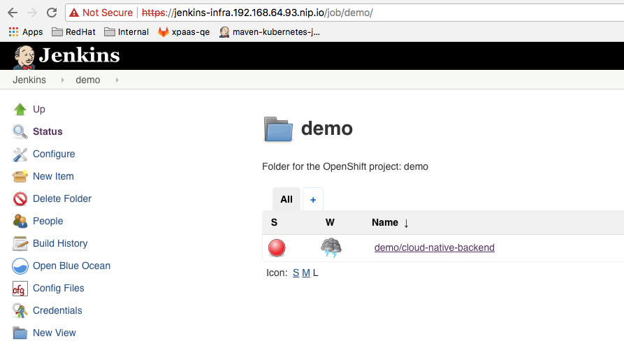

# Instructions to configure pipeline and jenkins installed in a different namespace

- Start Minishift using Openshift 3.7
```bash
minishift start
minishift config set image-caching true
minishift config view 
- cpus                 : 2
- image-caching        : true
- memory               : 5GB
- openshift-version    : v3.7.1
- vm-driver            : xhyve

oc login -u admin -p admin
```

- Create the `demo` project where the pipeline will be deployed

```bash
oc new-project demo
```

- Deploy the jenkins `pipeline` using the `Jenkinsfile` part of the github `cloud-native-backend` project 

```bash
git clone https://github.com/snowdrop/cloud-native-backend.git && cd cloud-native-backen
oc new-build --strategy=pipeline https://github.com/snowdrop/cloud-native-backend.git
```

- Check if the pipeline starts after the jenkins instance has been deployed locally.

- As this is not what we want to do, then we will change the `jenkinsPipelineConfig` config defined within the `master-config.yaml` file 
  in order to disable the creation of a jenkins instance in an namespace which contains a `pipeline`.
  
```bash
minishift ssh
sudo vi /var/lib/minishift/openshift.local.config/master/master-config.yaml 
autoProvisionEnabled: true -> autoProvisionEnabled: false
minishift openshift restart
```  

Remark : instead of ssh and do a `sudo vi`, the master config file could be changed using `config set` cmd. See [here](https://docs.openshift.org/latest/minishift/openshift/openshift-client-binary.html#update-openshift-config)

- Delete the demo project and recreate it

```bash
oc project default
oc delete project demo
...
oc new-project demo
```

- Redeploy the pipeline

```bash
oc new-build --strategy=pipeline https://github.com/snowdrop/cloud-native-backend.git
```
- Check if the pipeline starts. That should not the case as no jenkins instance has been created within the `demo` namespace

- Install a jenkins instance within the `infra` project

```bash
oc new-project infra
oc new-app jenkins-ephemeral -n infra
oc project demo
```
- Edit the Jenkins configuration - https://jenkins-infra.192.168.64.93.nip.io/configure in order to define weithin the `openshift-sync-plugin` the: 
  - Namespace to be watched,
  - Credentials to be used by the `openshift-sync-plugin` to access the pipeline
  - Pattern of the job to be sync
  
- Move to the `openshift-sync-plugin` section and fill the field `namespace` with the name `demo`


- Create a serviceaccount under the `demo` project and get its token

```bash
oc create sa jenkins
oc serviceaccounts get-token jenkins -n demo
```

- Within the Jenkins Configuration screen, at the section about `openshift-sync-plugin`, click on the `add` button next to the field `credentials`.
  Select as type `Openshift Token for Openshify Sync Plugin` and copy/paste the token recuperated within the field `token`. Click on the `add` button.
  


-  Select from the dropdown list of the credentials the entry created.

  

- Specify also under the field `Sync Job Name Pattern`, the name of the `buildconfigs` which is fo us `cloud-native-backend` as patten to be used to sync the job

 

- Save your jenkins configuration by clicking on the button `save`.

- As the `jenkins` serviceaccount doesn't has access to watch `demo` namespace, then we will add to it the role `edit`

```bash
io.fabric8.kubernetes.client.KubernetesClientException: User "system:serviceaccount:demo:jenkins" cannot watch configmaps in the namespace "demo": User 
```

- Create the `rolebinding` file and apply it to the `demo` namespace

```bash
cat > rb_jenkins.yaml << 'EOF'
apiVersion: v1
kind: RoleBinding
metadata:
  labels:
    app: jenkins-ephemeral
    template: jenkins-ephemeral-template
  name: jenkins_edit
roleRef:
  name: edit
subjects:
- kind: ServiceAccount
  name: jenkins
  namespace: demo
userNames:
- system:serviceaccount:demo:jenkins
EOF
oc apply -f rb_jenkins.yaml 
```

- Then now, you should be able to see that your pipeline has started

 

- And that the job `demo/cloud-native-backend` has been created under the jenkins instance
  running within the `infra` namespace

 


